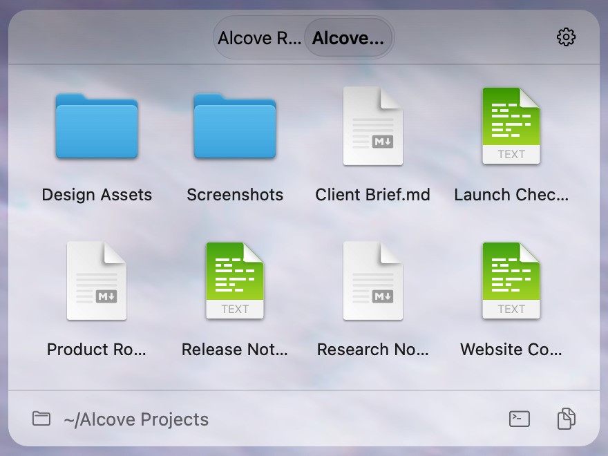
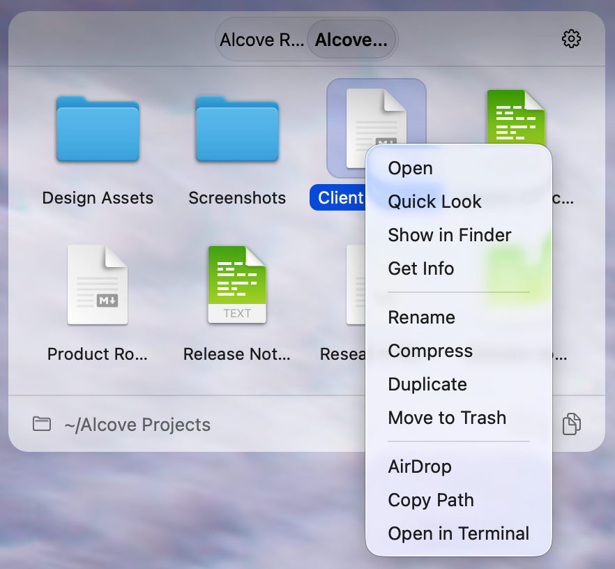
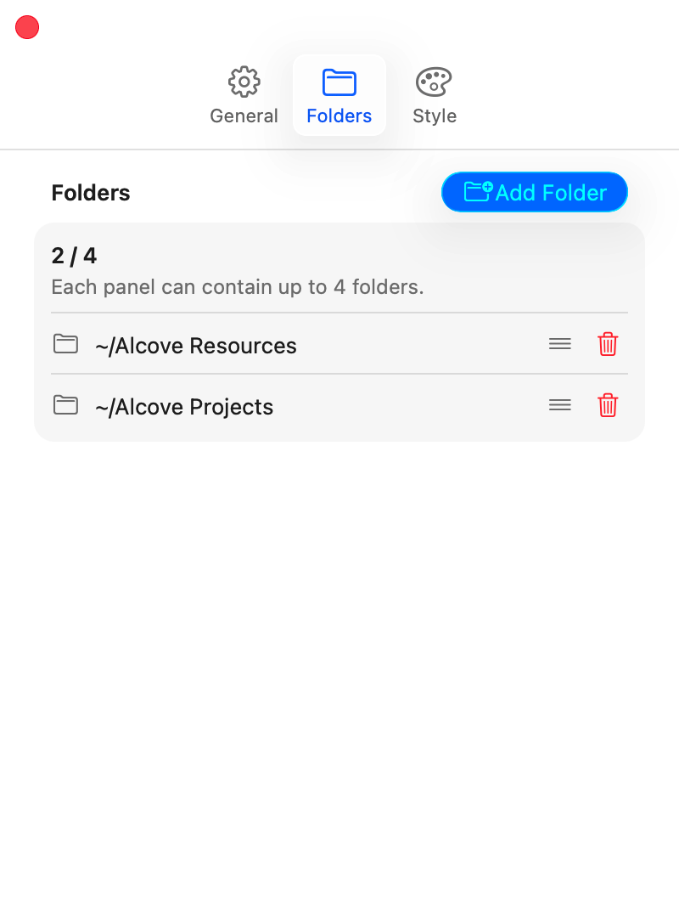
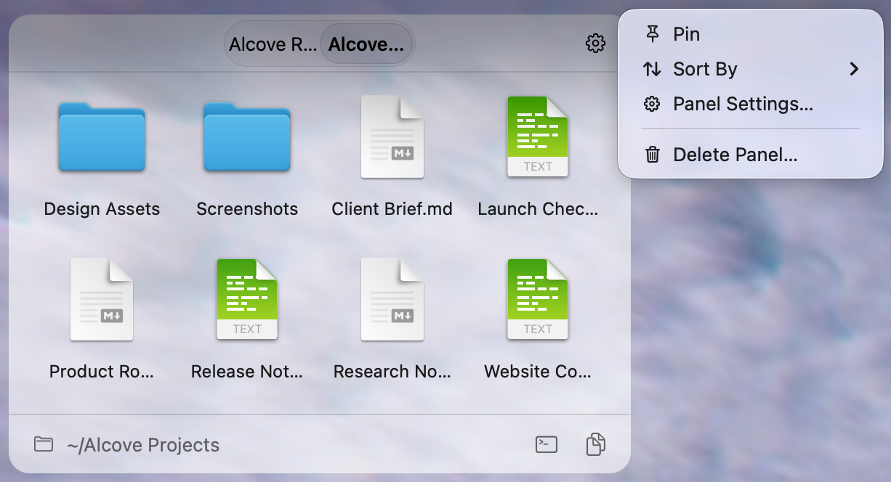
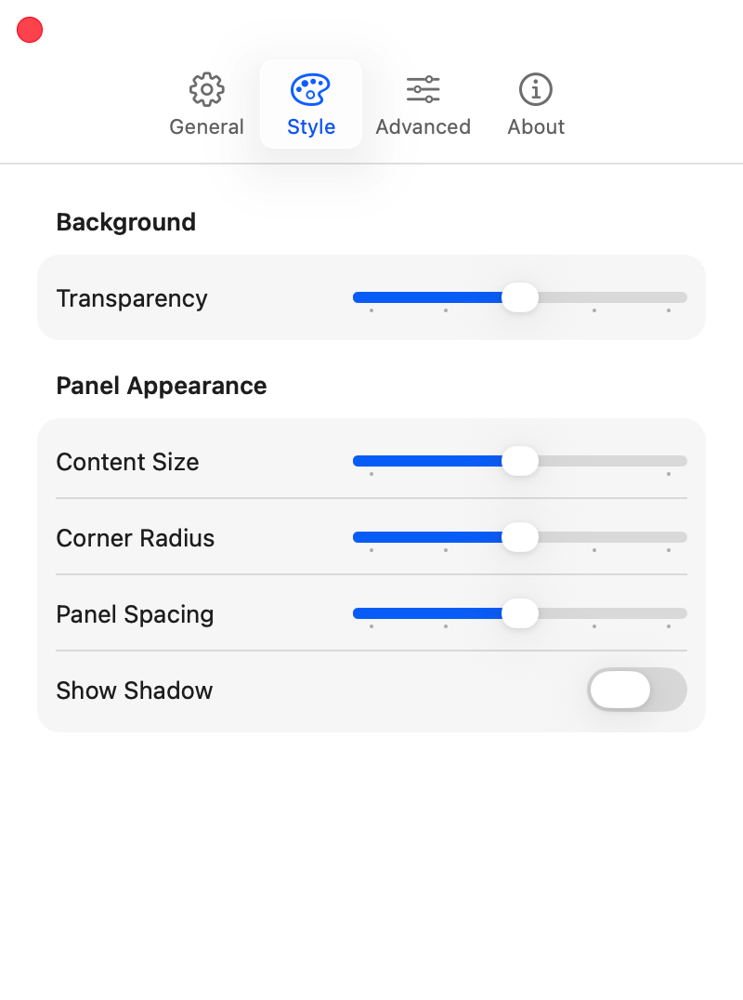
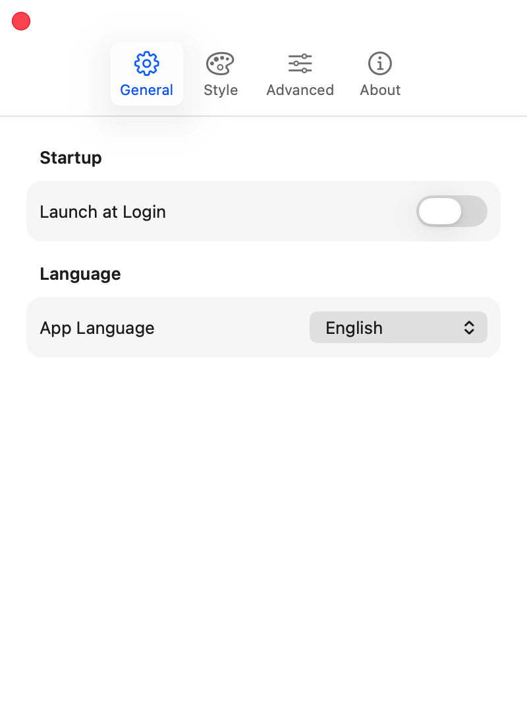

<div align="center">
  
  <h1>Alcove</h1>
  <p>一款原生 macOS 菜单栏工具，可在桌面上放置、移动和缩放文件夹面板。</p>
  <p>
    <strong>简体中文</strong> ·
    <a href="README.zh-TW.md">繁體中文</a> ·
    <a href="README.md">English</a> ·
    <a href="README.ja.md">日本語</a> ·
    <a href="README.ru.md">Русский</a>
  </p>
</div>

## Alcove 是什么

Alcove 会把本地文件夹显示成桌面层上的轻量面板。每个面板都有原生图标网格，可以滚动浏览，并支持多个标签页、接近 Finder 的选择操作、快速查看，以及显示器布局变化后的自动恢复。面板位于普通应用窗口下方、桌面图标上方。

**Alcove 不是 Finder 的替代品。** 它只是让常用文件夹一直待在桌面上，随时可以打开。

## 功能

<table>
  <tr>
    <td width="32%">
      <strong>桌面文件夹面板</strong><br><br>
      把常用的本地文件夹放在桌面上。面板可以移动、缩放，也可以用多个标签页切换文件夹。
    </td>
    <td width="68%"></td>
  </tr>
  <tr>
    <td>
      <strong>Finder 风格的文件操作</strong><br><br>
      在原生右键菜单中打开、预览、定位、重命名、压缩、复制、移到废纸篓、AirDrop、复制路径，或在终端中打开。
    </td>
    <td></td>
  </tr>
  <tr>
    <td>
      <strong>拖动创建面板</strong><br><br>
      直接在桌面上拖出新面板。创建时会显示实时网格预览，完成后再选择本机文件夹。
    </td>
    <td></td>
  </tr>
  <tr>
    <td>
      <strong>多个文件夹标签页</strong><br><br>
      每个面板最多添加四个文件夹，可以切换、排序和移除。各标签页会保留自己的浏览位置和选择状态。
    </td>
    <td align="center"></td>
  </tr>
  <tr>
    <td>
      <strong>面板控制</strong><br><br>
      固定面板位置、更改排序方式、打开面板设置，或从桌面移除面板。
    </td>
    <td></td>
  </tr>
  <tr>
    <td>
      <strong>外观设置</strong><br><br>
      调整透明度、内容大小、圆角、面板间距和窗口阴影。主要选项都采用固定档位，方便保持一致。
    </td>
    <td align="center"></td>
  </tr>
  <tr>
    <td>
      <strong>语言与启动</strong><br><br>
      支持登录时自动启动。界面可跟随 macOS，也可以单独选择英文、简体中文或繁体中文。
    </td>
    <td align="center"></td>
  </tr>
</table>

## 当前状态

> **MVP 功能已经完成**

应用主体、自动化测试和 arm64 构建检查已经完成。首次公开发布前仍需手动验证最终 DMG 的安装、Gatekeeper 行为，以及多显示器、Spaces 和 Stage Manager 下的系统表现。

## 系统要求

| 项目 | 要求 |
|---|---|
| 最低系统 | macOS 26 Tahoe |
| 兼容目标 | macOS 26 和 macOS 27 Golden Gate |
| 处理器 | Apple Silicon（arm64） |
| 应用类型 | 菜单栏 LSUIElement 应用，不显示 Dock 图标，不使用沙盒 |
| 文件夹范围 | 仅支持内置固定磁盘上的本地文件夹 |
| 发布方式 | GitHub Releases 提供一个经过 Apple Development 签名、未经公证的 DMG |

## 安装与发布

每个 GitHub Release 只包含一个 `Alcove.<版本号>.dmg`。打开 DMG，把 `Alcove.app` 拖进 `Applications`。当前版本使用免费的 Apple Development 证书签名，但没有经过 Apple 公证。首次打开前，请按 Release Notes 的说明移除下载隔离属性：

```bash
sudo xattr -rd com.apple.quarantine /Applications/Alcove.app
```

发布版本支持 `x.y.z`、`x.y.z-alpha.n` 和 `x.y.z-beta.n`。具体变更见 [CHANGELOG.md](CHANGELOG.md)。

## 主要设计

- 使用原生 AppKit，不使用 WidgetKit。
- 面板采用稳定的静态半透明背景，支持五档透明度和每个面板独立配色。
- 文件选择、快速查看、拖放和右键菜单尽量保持 Finder 的操作习惯。
- 全局外观和语言保存在 `UserDefaults`；面板布局使用版本化 JSON 文件保存。
- 不包含遥测、分析或网络请求，所有状态只保存在本机。

## 文档

| 文档 | 内容 |
|---|---|
| [当前交接](docs/HANDOFF.md) | 当前需求、实现进度、已知风险和交接记录 |
| [产品需求](docs/PRODUCT_REQUIREMENTS.md) | 产品目标、交互规则和验收标准 |
| [架构](docs/ARCHITECTURE.md) | 模块边界、数据模型、持久化和并发设计 |
| [研究记录](docs/RESEARCH.md) | API 资料、技术验证和参考项目 |
| [交付计划](docs/DELIVERY_PLAN.md) | 开发阶段、测试矩阵和发布门槛 |

## 许可证

Copyright © 2025–2026 SlippinDylan Studio。Alcove 使用 [Apache License 2.0](LICENSE) 开源许可证。
