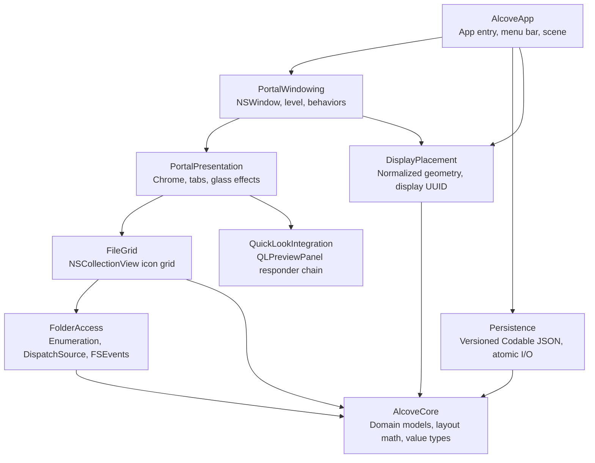

# Candidate Architecture — Alcove

**Status:** This document is a pre-Phase 0 candidate baseline built from research, reference observations, and architectural inference. Any choice that depends on a Prototype Gate is provisional. Until the Phase 0 product-and-architecture gate is resolved, these choices are not immutable production constraints and must not be treated as confirmed platform behavior.

If a spike fails, Alcove may revise either the candidate architecture or the affected product scope. An untested fallback must not be used to hide or relabel a failed feasibility result. Spike 0.6 is a separate release gate: it may run alongside product development, but its signing and distribution conclusions remain provisional until resolved.

## 1. Architectural Principles

| # | Principle | Enforcement |
|---|-----------|-------------|
| P-1 | **Domain logic is UI-free** | AlcoveCore has zero AppKit/SwiftUI imports; tested without host app |
| P-2 | **Dependencies flow inward** | AlcoveCore is the single UI-free Swift package; internal feature groups within the Xcode app target enforce dependency direction in code |
| P-3 | **No force unwraps or broad casts** | All optionals handled with `guard let`/`if let`; no `as!`, no `Any`→typed casts without `as?` |
| P-4 | **Main actor for UI, explicit off-main I/O boundary** | `@MainActor` on all view/window controllers; `FolderLoadingActor` coordinates loading state while blocking file-system work crosses a dedicated, verified background execution boundary |
| P-5 | **Stale results are rejected, not applied** | Every async pipeline carries a monotonic generation counter; UI discards out-of-order completions |
| P-6 | **System-driven moves never overwrite user placement** | Display-placement state machine distinguishes user vs. system origin before writing |
| P-7 | **Prototype gates are explicit** | Window strategy, display identity/placement, Quick Look, Liquid Glass/fallback, folder observation/permissions, and signing/distribution remain provisional until their corresponding spikes are resolved |
| P-8 | **Folder-source eligibility is validated at selection boundaries** | Resolve the selected directory's hosting volume and reject removable, ejectable, or network volumes before a tab can reference it |

---

## 2. Module Boundaries & Dependency Graph



### Dependency Rules

1. **AlcoveCore** is the leaf — depends on nothing; no AppKit, no Foundation file I/O.
2. **Persistence** depends only on AlcoveCore. It owns serialization format and version negotiation.
3. **DisplayPlacement** depends only on AlcoveCore. It owns coordinate math and display identity.
4. **FolderAccess** depends only on AlcoveCore. It owns enumeration and file-system observation.
5. **FileGrid** depends on AlcoveCore and FolderAccess. It owns `NSCollectionView` data source and delegate.
6. **PortalPresentation** depends on FileGrid and QuickLookIntegration. It owns chrome, tab bar, and glass effects.
7. **PortalWindowing** depends on PortalPresentation and DisplayPlacement. It owns `NSWindow` lifecycle and behaviors.
8. **QuickLookIntegration** uses AppKit and QuickLookUI; it injects into the responder chain between `PortalWindow` and `NSApplication`.
9. **AlcoveApp** is the composition root — depends on everything. It owns `NSApplicationDelegate`, `NSStatusItem`, and portal lifecycle coordination.

Dependencies are acyclic and point toward AlcoveCore or an explicitly declared feature interface. Cross-feature dependencies are limited to the arrows shown above.

The module boundaries describe the intended separation of responsibilities. Modules and implementation choices marked provisional below may change when Spikes 0.1–0.5 resolve the product-and-architecture gate. Release packaging and signing remain governed separately by Spike 0.6.

---

## 3. Module Responsibilities

### 3.1 AlcoveCore

Domain models and pure layout math. Zero AppKit imports.

- `Portal` — top-level aggregate; valid states are either no tabs with no selected tab, or one-or-more tabs with a selected tab contained in that list
- `FolderTab` — tab identity and folder URL reference
- `FileItem` — enumerated file/folder entry
- `SelectionState` — per-tab selection model
- `IconSize` — validated icon dimension value type
- `PortalIconLayout` — an Alcove-owned fixed Small, Medium, or Large icon size with the standard label metric
- `PortalBackgroundStyle` — ordered five-level background value carried by runtime Portal state but governed by the application-global preference
- `GridCapacity` — validated visible grid columns and rows; it is the durable size intent for a portal
- `Portal.isPinned` — persisted interaction state that disables user-driven movement and resizing without suppressing system placement directives
- `GridLayout` — computes item frames from container size, icon size, column count, and spacing
- `PlacementGeometry` — captures and restores per-display frames with normalized movable-range anchors
- `PlacementStateMachine` — preserves user-confirmed home placement while emitting transient topology directives
- `PortalFrameConstraints` — pure validation and swept-AABB drag geometry for display-edge and inter-Portal spacing; fast pointer motion cannot tunnel through another Portal
- `PortalFrameReflow` — deterministically derives fixed-size runtime frames from saved frames, current `visibleFrame`, stable Portal order, and the selected spacing. Screen-edge and inter-Portal gaps within the maximum 20pt attachment range are normalized to the selected exact value; unrelated free placements remain at their intended coordinates. It clamps earlier Portals first and places each later Portal at its nearest legal candidate; failure leaves the existing layout and preference unchanged.

### 3.2 AlcoveApp

App entry point and global coordination.

- `AppDelegate` — `NSApplicationDelegate`, menu-bar `NSStatusItem` lifecycle
- `PortalCoordinator` — creates/destroys portals, routes user actions
- `StatusMenuController` — builds the localized New Portal / Portal Show-Hide / application Settings / Quit hierarchy and routes Settings to one reusable application settings window
- `ApplicationSettingsWindowController` — owns the preference-style General/Style/Advanced/About window. General adapts `SMAppService.mainApp` for launch-at-login registration; Style stores global content size, background level, spacing, corner radius, and shadow in `UserDefaults`; Advanced presents the layout backup import/export workflow; About reads version metadata and the compiled Icon Composer application icon
- `ApplicationLayoutBackupController` — presents JSON-constrained `NSOpenPanel`/`NSSavePanel` sheets, performs blocking read/atomic write on an actor, confirms replace-only imports, and reports errors as sheets
- `NewPortalOverlay` — pointer-display overlay with a dashed `3×1` rounded frame, full-width separators, complete object tiles, half-cell candidate feedback, and whole-capacity snapping constrained to the inset `visibleFrame`; occupied candidates remain editable and cannot commit
- Info.plist: `LSUIElement = YES`, `LSBackgroundOnly = NO`

### 3.3 PortalWindowing

`NSWindow` ownership and behavior configuration.

- `PortalWindow` — provisional `NSWindow`/`NSPanel` abstraction whose concrete type and strategy are selected by Spike 0.1.
- The first candidate uses:
  - `level = CGWindowLevelForKey(.desktopIconWindow) + 1`
  - `collectionBehavior = [.canJoinAllSpaces, .stationary, .ignoresCycle]`
- The spike harness must make strategies switchable and compare `.stationary`, `.moveToActiveSpace`, `.fullScreenAuxiliary`, use or omission of `.canJoinAllSpaces`, `NSWindow` versus `NSPanel`, and whether the portal may become key.
- Final window level, collection behaviors, window class, and key-window policy are provisional until Spike 0.1 is resolved.
- Production development uses the replaceable Phase 0.1D default: key-eligible `NSWindow`, `desktopIconWindow + 1`, and `[.canJoinAllSpaces, .stationary, .ignoresCycle]`. This is an implementation starting point, not a claim that the manual WindowServer matrix passed.
- Regardless of the selected strategy, the portal must provide:
  - Application-tracked dragging from non-control space in the top control row,
    while preserving the system resize hit regions along the window edges
  - Standard resize from edges/corners
  - Frame snap to grid metrics on move/resize end
- `PortalWindowController` — emits placement commits only after tracked drag mouse-up or live-resize end; generic frame notifications never imply user intent
- `PortalCoordinator` injects synchronous geometry closures into each window. Dragging uses the pointer's fresh destination display and current runtime frames of other windows; live resize validates the actual frame delivered by AppKit and restores the last legal frame. The final persistence transaction revalidates to close races.
- A spacing preference change is preflighted per display before it is accepted. The Coordinator animates the complete derived plan through system-placement calls, retains separate unspaced base frames, and never reports those style-driven moves as user placement. Recomputing from the same bases makes spacing changes reversible without modifying v11 home placement.
- Display handoff follows the pointer's containing or nearest fresh `visibleFrame`; this keeps multi-display movement available rather than permanently clamping a Portal to its source display.

### 3.4 PortalPresentation

Visual chrome inside each portal window.

- `PortalViewController` — root view controller per portal
- `TabBarView` — one centered, horizontally scrollable folder-name strip and a fixed trailing settings icon. Folder tabs use the native capsule-shaped Glass button bezel on macOS 26, with tint prominence indicating selection; macOS 15–25 retain the existing material-aware capsule fallback. The settings icon presents one reusable standalone settings window centered on the Portal's current screen. A close-only standard titlebar remains above a native preference-style `NSToolbar`; an explicit system separator divides it from scrollable grouped content. An `NSTableView` in plain style displays home-abbreviated folder paths without automatic row insets and provides native gap feedback for atomic drag reordering. Per-Portal size/background controls are absent because those values are application-global.
- `FolderPathBarView` — a plain reserved bottom row derived from the selected tab URL; it abbreviates the home directory as `~` and copies the displayed path to `NSPasteboard`
- `PortalChromeMaterialView` — the content surface keeps an always-active `.popover`-material `NSVisualEffectView` at full strength; global background level controls overlay strength while each Portal selects a persisted neutral/red/orange/yellow/green/blue/indigo/purple hue
- Layout: tab bar at top, a fixed path row at bottom, and the icon grid between them. Both chrome rows are included in creation, minimum-size, live-resize, and persisted-capacity geometry
- Portal size intent is `GridCapacity`, not a remembered pixel size. Creation and manual icon-size changes derive the content frame from the same `GridMetrics`; changing Small/Medium/Large preserves capacity and the Portal's top-left position while recomputing the physical frame toward the trailing and bottom edges. The resize uses the current home-display `visibleFrame` when available and falls back to its remembered reference frame when a current descriptor is unavailable. New Portal creation starts at Medium.
- Rendering hierarchy: the background material, file grid, top control row,
  bottom path row, and two full-width separators are sibling layers in a plain root
  container. The top and bottom rows add no full-width capsule material; only
  each folder tab is a compact control rather than an enclosing strip capsule.

### 3.5 FileGrid

`NSCollectionView`-based icon grid.

- `FileGridViewController` — owns `NSScrollView` + `NSCollectionView`
- `PortalViewController` keeps a runtime-only navigation state per `FolderTabID`: the durable `FolderTab.folderURL` remains the root, while `currentURL`, back history, selection, and scroll position follow in-Portal navigation. Loading, FSEvents observation, the path bar, Finder, Terminal, and future drop destinations all consume the same current URL.
- The controller explicitly keeps the document collection width equal to the scroll viewport width during layout. `GridCapacity.columns` is authoritative for the pure row-major `GridLayout`; window-border or clip-view rounding must never derive a different column count. Live-resize capacity changes invalidate the layout immediately, so items reflow in sequence in both directions.
- Vertical overflow uses AppKit's mini overlay scroller with automatic hiding, so it does not reserve horizontal content space and retains native scrolling/accessibility behavior.
- `FileItemCell` — one accessible tile with a thin outline exposing its complete object bounds, containing a padded system icon, a two-line title, and separate Finder-style icon/title selection regions
- `FileGridDataSource` — bridges `FolderAccess` enumeration results to collection view items
- `FileGridDelegate` — handles selection, double-click, keyboard events, and forwards to `QuickLookIntegration`
- Selection protocol: single-click select, Command-click toggle, Shift-click range, arrow keys navigate

### 3.6 QuickLookIntegration

`QLPreviewPanel` integration via responder chain.

- A dedicated `QuickLookIntegration` responder implements `QLPreviewPanelDataSource` and `QLPreviewPanelDelegate`
- `PortalWindowController` inserts it between `PortalWindow` and the window's previous responder, then restores the exact previous link on detach
- The integration owns an ordered URL snapshot, presents on Space when selection is non-empty, and dismisses on second Space only while Alcove still owns the visible panel
- Tab switches invalidate the old URL snapshot and relinquish panel control; window teardown clears only data-source/delegate references still owned by that integration
- **Prototype gate:** responder chain behavior requires spike validation on each macOS version target

### 3.7 FolderAccess

Directory enumeration and live observation.

- `FolderEnumerator` — returns `[FileItem]` for a given URL; default ordering: directories first, then localized standard name
- `FolderLocationValidator` — resolves the selected directory's hosting volume and accepts only internal, non-removable, non-ejectable local storage; selection and re-mapping reject all other locations before persistence
- `FolderObserver` — FSEvents adapter using `FileEvents`, `WatchRoot`, and `UseCFTypes`; monitors only the active tab's mapped directory and treats records as snapshot invalidation evidence.
- `FolderObservationCoordinator` — debounces ordinary records into full reloads; recovery flags stop and revalidate path, volume, and device/inode before a fresh stream starts
- `FolderLoadingActor` coordinates generation tokens, cancellation requests, and result ordering; it does not by itself put synchronous file I/O on a background thread.
- Blocking enumeration crosses an explicit background execution boundary such as a dedicated `DispatchQueue`, `OperationQueue`, or a verified asynchronous wrapper.
- Cooperative cancellation requires incremental or batched enumeration with checks at defined boundaries. A single `FileManager.contentsOfDirectory` call cannot be cancelled midway.
- Stale rejection: each enumeration carries a `Generation` counter; UI discards completions whose generation doesn't match the current one

### 3.8 DisplayPlacement

Display identity, coordinate normalization, and placement state machine.

- `DisplayIdentity` — wraps `CGDisplayCreateUUIDFromDisplayID` output (stability through disconnect/reconnect is inference, requires spike validation)
- `NormalizedAnchor` — portal origin expressed as fractions of the actual movable range within `NSScreen.visibleFrame`, after constraining the portal size
- `DisplaySnapshot` — captures canonical display UUIDs, visible frames, and the explicit primary display without treating `NSScreen.screens` order as identity
- `DisplayPlacementObserver` — refreshes topology after screen-parameter changes and wake notifications
- `PortalStore` — persists per-portal, per-display placement records
- State machine (§6) — distinguishes explicit user placement commits from system-driven evictions

### 3.9 Persistence

Versioned JSON storage with atomic replacement.

- Location: `~/Library/Application Support/Alcove/portals.json`
- Format: JSON object with `version: Int` at top level, followed by data payload
- Persistence uses versioned Codable DTOs and maps to validated domain models
- Current schema is v11: v6's optional selected tab and v7's required `is_pinned` remain; v8 records compact 8pt vertical grid insets, v9 records equal 4pt tile spacing, v10 removes Finder-following state while expanding background control to five levels, and v11 adds per-Portal sort order and one of the built-in tint presets
- Persistence is infrastructure outside AlcoveCore (contains domain/layout only); `PortalStore`, `NSScreen` lookup, `DisplayIdentity` adapters, and file I/O remain app infrastructure
- Write strategy: write to `.tmp` file, then `FileManager.replaceItemAt` for atomic swap
- Read strategy: read file → check `version` → dispatch to appropriate decoder → return typed result or migration error
- No Core Data or SQLite. Versioned Portal state remains JSON; `UserDefaults` is used only for application-global preferences and does not duplicate per-Portal v11 sort/tint state.
- The public layout-backup envelope has its own `com.alcove.layout-backup` format marker and version lifecycle. Version 1 stores semantic global appearance values plus each Portal's normalized anchor, capacity, sort, tint, pin, and home-relative/absolute folder paths. It excludes launch-at-login and does not expose the machine-specific internal v11 placement envelope.
- Import maps every Portal to a fresh primary-display placement, derives physical size from imported capacity and global icon metrics, reflows the complete layout at the imported spacing, and calls `PortalStore.save` once before replacing any runtime windows. Import never merges and accepts missing folder paths so the existing recoverable missing-folder state remains authoritative.
- AppKit strings use `en`, `zh-Hans`, and `zh-Hant` bundle resources. English is the development region and fallback for every other system language

---

## 4. Domain Models & Validated Value Types

All types live in `AlcoveCore`. No force unwraps (`!`), no broad casts (`as!`, `as Any`).

### 4.1 Portal

```swift
struct Portal: Identifiable, Sendable {
    let id: PortalID
    var tabs: [FolderTab]
    var selectedTabID: FolderTabID
    var iconSize: IconSize
    var placement: PlacementRecord

    init(id: PortalID = PortalID(), tabs: [FolderTab], selectedTabID: FolderTabID,
         placement: PlacementRecord, iconSize: IconSize = .medium) throws { ... }
}
```

### 4.2 FolderTab

```swift
struct FolderTab: Identifiable, Sendable {
    let id: FolderTabID
    var folderURL: URL           // standardized file URL (non-sandboxed, no bookmark)

    var displayName: String { folderURL.lastPathComponent }

    init(id: FolderTabID = FolderTabID(), folderURL: URL) { ... }
}
```

Sorting is not exposed in MVP. Default ordering: directories first, then localized standard name.

### 4.3 FileItem

`FileItem` is runtime state, not `Codable`. Identity is derived from the standardized URL (or a scoped file identity), not a fresh `UUID` each enumeration.

```swift
struct FileItem: Identifiable, Sendable, Hashable {
    let id: FileIdentity       // derived from standardized URL, stable across enumerations
    let url: URL
    let name: String
    let isDirectory: Bool
    let isHidden: Bool

    /// FolderAccess supplies already-validated metadata; AlcoveCore performs no file I/O.
    init(url: URL, name: String, isDirectory: Bool, isHidden: Bool) {
        self.id = FileIdentity(standardizedURL: url.standardizedFileURL)
        self.url = url.standardizedFileURL
        self.name = name
        self.isDirectory = isDirectory
        self.isHidden = isHidden
    }
}

/// Stable identity derived from standardized file URL.
struct FileIdentity: Hashable, Sendable {
    let path: String  // url.standardizedFileURL.path
}
```

Metadata beyond name and directory status (file size, modification date) is deferred; default ordering is directories first, then localized standard name.

### 4.4 SelectionState

```swift
struct SelectionState: Sendable {
    private(set) var selectedIDs: Set<FileIdentity>
    private(set) var anchorID: FileIdentity?   // for Shift-click range
    private(set) var focusID: FileIdentity?

    mutating func select(_ id: FileIdentity) { ... }
    mutating func toggle(_ id: FileIdentity, in orderedIDs: [FileIdentity]) { ... }
    mutating func extendRange(to id: FileIdentity, in orderedIDs: [FileIdentity]) { ... }
    mutating func selectAll(_ ids: [FileIdentity]) { ... }
    mutating func clear() { ... }
    mutating func reconcile(with orderedIDs: [FileIdentity]) { ... }
}
```

### 4.5 Validated Value Types

No force unwraps. Presets use a private validated path; public construction is failable.

```swift
struct IconSize: Sendable, Comparable {
    let rawValue: CGFloat

    private init(validated value: CGFloat) { self.rawValue = value }

    /// Returns nil if value is outside [32, 128].
    init?(rawValue: CGFloat) {
        guard rawValue >= 32 && rawValue <= 128 else { return nil }
        self.rawValue = rawValue
    }

    static let small  = IconSize(validated: 48)
    static let medium = IconSize(validated: 64)
    static let large  = IconSize(validated: 80)

    static func < (lhs: IconSize, rhs: IconSize) -> Bool { lhs.rawValue < rhs.rawValue }
}

Grid capacity is durable Portal state. `GridCapacity.columns` is supplied directly to the
collection layout and keyboard navigation; the current available width may affect content width
but must not silently replace the persisted column count.
```

### 4.6 PlacementRecord

Stores both preferred absolute frame (in points) and an origin normalized within the actual movable range of `visibleFrame`. Restoration policy: if the same display has unchanged geometry, prefer the saved absolute frame; if geometry changed, constrain preferred size, compute the movable range, restore the normalized anchor, then grid-snap and clamp to `visibleFrame`.

```swift
struct PlacementRecord: Sendable {
    /// Keyed by display UUID string.
    var framesByDisplay: [String: DisplayPlacementEntry]
    /// The display UUID the user last explicitly placed this portal on.
    var homeDisplayUUID: String?
}

struct DisplayPlacementEntry: Sendable {
    /// Absolute frame in points, as saved by the user.
    var absoluteFrame: CGRect
    /// NSScreen.visibleFrame used when this entry was saved.
    var referenceVisibleFrame: CGRect
    /// Origin normalized within the movable range at save time.
    var normalizedAnchor: NormalizedAnchor
    /// Preferred portal size in points (width, height).
    var preferredSize: CGSize
}

struct NormalizedAnchor: Sendable {
    /// Fractions of the window's movable range inside NSScreen.visibleFrame.
    /// x: 0.0 = leftmost origin, 1.0 = rightmost origin
    /// y: 0.0 = bottommost origin, 1.0 = topmost origin
    let x: Double
    let y: Double
}
```

---

## 5. Versioned Persistence & Migration

### 5.1 Storage Format

```json
{
  "version": 10,
  "portals": [ ... ]
}
```

All JSON keys are `snake_case`. Dates are ISO 8601.

### 5.2 Version Negotiation

| `version` value | Behavior |
|-----------------|----------|
| Matches current decoder | Decode directly |
| Lower than current | Run the explicit migration path from the stored version to current |
| Higher than current | Fail with `.unsupportedVersion(Int)`; do not attempt partial read |
| Missing or malformed | Fail with `.corruptedFile` |

### 5.3 Migration Strategy

The concrete v1 migration maps each legacy frame to the display with the largest positive
visible-frame intersection, falling back to the explicit primary display. Versions 1–3
default the icon layout to the stored fixed icon size; v1 and v2 also default the newer
per-portal background preference to Standard. Versions 1–4 derive `GridCapacity` from the
saved frame's grid-content size (after removing the tab bar) and their saved icon/text metrics;
version 5 already contains capacity, v6 introduced an optional `selected_tab_id` for durable
empty Portals, and v7 adds `is_pinned` plus the reserved bottom path row. Version 8 reduces the
grid's top and bottom insets from 16pt to 8pt, and v9 reduces horizontal tile spacing from 12pt
to the same 4pt used vertically. Version 10 removes `follow_desktop` from current data, maps any
legacy followed icon size to the nearest Small/Medium/Large preset, adds the two outer background
levels, and normalizes every migrated frame from its capacity and current metrics while preserving
its former top-right position when the display permits. Versions 1–10 are atomically rewritten as v11.
Before conversion the
store writes the matching `portals.vN.json.bak` once and never
replaces a different existing backup. Migrations remain explicit rather than using a
speculative generic framework.

### 5.4 Failure Policy

| Failure | Response |
|---------|----------|
| File not found (first launch) | Return empty state; create file on first save |
| File corrupted / unreadable | Log error; present user with option to reset or restore from backup |
| Migration fails (once a migration exists) | Preserve original file as `.bak`; present a recoverable error and do not overwrite the source |
| Disk full on write | Catch `NSCocoaErrorDomain` code 640 (disk full); surface to user; do not lose in-memory state |
| Atomic replace fails | Preserve in-memory state; retry once on next save cycle |

### 5.5 Backup

The v1/v2/v3/v4/v5/v6/v7/v8/v9/v10→v11 migrations preserve the original as the matching
`portals.vN.json.bak`. The first backup is write-once; a different existing backup stops
migration instead of overwriting evidence.

---

## 6. Portal Window & Display State Machine

### 6.1 Window States

```
┌─────────┐   user creates   ┌──────────┐   user closes   ┌───────────┐
│ (absent) │ ───────────────→ │  active   │ ──────────────→ │ destroyed │
└─────────┘                   └──────────┘                  └───────────┘
                               ▲       │
                    display    │       │ display
                    reconnected│       │ disconnected
                               │       ▼
                          ┌─────────────┐
                          │  displaced   │
                          └─────────────┘
```

### 6.2 Display Event Handling

| Event | Origin | Action |
|-------|--------|--------|
| User ends drag or live-resize session | User | Write absolute frame and normalized anchor to `framesByDisplay[currentDisplayUUID]`; update `homeDisplayUUID` |
| Display disconnected | System | If portal was on that display, move to primary screen clamped to `visibleFrame`; do **not** overwrite `framesByDisplay[disconnectedUUID]` |
| Display reconnected | System | If `framesByDisplay[reconnectedUUID]` exists, apply the same-geometry or changed-geometry restoration policy; mark portal as active on that display |
| Resolution/scaling change | System | Constrain preferred size, compute movable range, restore the normalized anchor, grid-snap, and clamp to new `visibleFrame` |
| Sleep/wake | System | Re-read `NSScreen` geometry and apply the same-geometry or changed-geometry restoration policy |
| Spaces transition | System | Desired behavior: portal remains on every Space without persisted-state mutation; the desktop-layer spike determines whether the selected window behaviors achieve this reliably |

### 6.3 User vs. System Move Distinction

The display placement state machine writes only at the end of explicitly tracked user drag and live-resize sessions. Both the drag handle and window resize edges are tracked. Window frame notifications alone are not proof of user origin — this remains spike-validated.

`PortalWindow` disables server-side background dragging and intercepts mouse-down only in
non-control space inside the top control row, excluding the resize edges. It tracks global pointer drag events to mouse-up and emits
one user placement commit only after an actual drag. Live resize uses
`windowWillStartLiveResize`/`windowDidEndLiveResize`. `windowDidMove`, `windowDidResize`,
Spaces, Stage Manager, and topology-driven `setFrame` calls never write placement state.

This prevents Show Desktop, Spaces transitions, or Stage Manager reflow from overwriting the user's chosen position.

---

## 7. Placement Restoration Algorithm

### 7.1 Save (user ended drag or live-resize)

```
1. Get currentDisplay = NSScreen containing portal window
2. Get visibleFrame = currentDisplay.visibleFrame  (accounts for menu bar and Dock; safe-area behavior is verified separately)
3. Constrain portalWindow.frame.size to visibleFrame; this constrained frame is absoluteFrame
4. Compute the actual movable range:
     movableWidth = max(0, visibleFrame.width - absoluteFrame.width)
     movableHeight = max(0, visibleFrame.height - absoluteFrame.height)
5. Compute normalized anchor within that movable range:
     nx = movableWidth > 0
          ? (absoluteFrame.minX - visibleFrame.minX) / movableWidth
          : 0
     ny = movableHeight > 0
          ? (absoluteFrame.minY - visibleFrame.minY) / movableHeight
          : 0
6. Clamp nx and ny to 0...1 before storing
7. Store DisplayPlacementEntry(absoluteFrame, visibleFrame, NormalizedAnchor(nx, ny), absoluteFrame.size) in framesByDisplay[displayUUID]
8. Update homeDisplayUUID = currentDisplayUUID
```

### 7.2 Restore (display available, same geometry)

```
1. Look up DisplayPlacementEntry for displayUUID in framesByDisplay
2. Get current visibleFrame for that display
3. If visibleFrame is unchanged from save time (same origin and size):
     - Use saved absoluteFrame directly
     - Constrain size to visibleFrame, then grid-snap and clamp to visibleFrame
4. Set portalWindow.frame
```

### 7.3 Restore (display available, geometry changed)

```
1. Look up DisplayPlacementEntry for displayUUID in framesByDisplay
2. Get current visibleFrame for that display
3. Constrain preferredSize to current visibleFrame
4. Compute the actual movable range using the constrained size:
     movableWidth = max(0, visibleFrame.width - constrainedSize.width)
     movableHeight = max(0, visibleFrame.height - constrainedSize.height)
5. Restore the origin from the normalized anchor:
     ax = visibleFrame.minX + clamp(nx, 0...1) * movableWidth
     ay = visibleFrame.minY + clamp(ny, 0...1) * movableHeight
6. Form the candidate frame from the restored origin and constrained size
7. Grid-snap the candidate frame, then clamp it to visibleFrame
8. Set portalWindow.frame
```

The normalized anchor expresses the portal origin's relative position within the space in which that specific window size can actually move. It does not divide by the full display width or height. Operation order is fixed: constrain size, calculate movable range, restore origin, grid-snap, then clamp.

### 7.4 Eviction to Primary Screen

```
1. Resolve a primary screen with `NSScreen.main ?? NSScreen.screens.first`
2. If no screen is available during a transient display reconfiguration, defer eviction until the next screen-parameters notification
3. primaryFrame = resolvedScreen.visibleFrame
4. Compute clamped position: center of portal stays within primaryFrame
5. If portal width > primaryFrame.width, shrink to fit
6. Set portalWindow.frame to clamped rect
7. Do NOT write to framesByDisplay[anyUUID] — preserve home placement
```

---

## 8. Folder Enumeration & Observation Pipeline

### 8.1 Enumeration

```
User selects tab
    │
    ▼
TabController requests FolderEnumerator.enumerate(url, showHidden)
    │
    ▼
FolderLoadingActor records request generation and coordinates cancellation/result order
    │
    ▼
Dedicated background execution boundary performs blocking or incremental file-system work
    ├─ FileManager.contentsOfDirectory(at:includingPropertiesForKeys:options:)
    ├─ Map each URL → FileItem (throwing; collect per-item diagnostics)
    ├─ Filter hidden files if !showHidden
    ├─ Sort: directories first, then localized standard name
    ├─ If enumeration is incremental/batched, check cancellation at item or batch boundaries
    └─ If using one synchronous contentsOfDirectory call, cancellation takes effect only before or after that call
    │
    ▼
Return [FileItem] + Generation counter + per-item diagnostics
    │
    ▼
FileGridDataSource receives result on @MainActor
    ├─ If generation != currentGeneration → discard (stale)
    └─ Else → apply diff to NSCollectionView
```

**File enumeration error policy:** Root enumeration failure (directory not found, permission denied) is fatal for that tab — surface error state. Per-item metadata errors (unreadable entries) are collected as diagnostics and surfaced if needed; accessible items are still listed.

`FolderLoadingActor` owns coordination state: request generations, cancellation intent, and result ordering. Actor isolation alone does not guarantee that synchronous file I/O runs on a dedicated background thread. The concrete enumerator must cross an explicit and tested background boundary, such as a dedicated `DispatchQueue`, `OperationQueue`, or verified asynchronous wrapper. The `@MainActor` load coordinator starts a lifecycle-bound task, requests cancellation on tab changes or teardown, and applies only the current generation.

For fine-grained cooperative cancellation, the implementation must enumerate incrementally or in batches and check cancellation at documented boundaries. `FileManager.contentsOfDirectory` is a one-shot synchronous call and cannot be interrupted midway; documentation and tests must reflect that limitation rather than promise an impossible in-call cancellation.

### 8.2 Observation

Active tab only. Idle tabs are re-enumerated on switch. Phase 0.5C7 selects FSEvents as the sole production mechanism.

```
FolderObserver.start(url)
    │
    ▼
FSEvents adapter (FileEvents + WatchRoot + UseCFTypes)
    │
    ▼
On event:
    ├─ Ordinary item flags → debounce 200ms → increment generation → full re-enumeration
    ├─ Drop/wrap/RootChanged → invalidate generation → bounded stream teardown
    │   └─ Revalidate path, supported volume, and root device/inode
    │       ├─ Missing/different identity → folderNotFound + explicit Locate Folder…
    │       └─ Same identity → start fresh stream before full re-enumeration
    └─ Apply only the current generation; events during enumeration schedule another refresh
```

Phase 0.5C7 selected FSEvents after both candidates passed local mutation, teardown, resource, multiple-observer, load, and lifecycle evidence. DispatchSource was substantially faster locally but provides directory-level invalidation only, remains attached to a moved inode after pathname replacement, and has no explicit dropped-event signal. Alcove does not need FSEvents item-level patching; its root-change and dropped/wrapped flags provide the stronger trigger for a fail-closed full rebuild. No dual-observer fallback is selected.

### 8.3 Cancellation

- Switching tabs cancels the in-flight enumeration `Task` for the previous tab.
- Closing a portal cancels all its tab `Task`s.
- `FolderObserver` completes bounded stream teardown when the tab becomes inactive.
- Portal close stops the active stream synchronously on the main dispatch queue; late callbacks are rejected by the observation generation.

---

## 9. NSCollectionView Ownership

```
PortalViewController
    │
    ├─ TabBarView
    │
    └─ FileGridViewController (one per portal; model replaced on tab switch)
         │
         ├─ NSScrollView
         │    └─ NSCollectionView
         │         ├─ Data source: FileGridDataSource (bridges FolderAccess → items)
         │         ├─ Delegate: FileGridDelegate (selection, double-click, keyboard)
         │         └─ Supplementary views: (none in MVP)
         │
         └─ FileItemCell (NSCollectionViewItem)
              ├─ Icon selection region
              │    └─ NSImageView (icon from NSWorkspace)
              └─ Title selection region
                   └─ NSTextField (file name, two-line character wrapping)
```

- Each portal creates one `FileGridViewController` and reuses its collection view for every tab.
- On tab switch, the controller saves the outgoing tab's runtime selection/scroll state, replaces the grid model, and restores the incoming tab's runtime state after loading.
- Item frames come from one fixed `GridLayout` used directly by the custom `NSCollectionViewLayout`; rendering, column count, keyboard navigation, portal minimum size, and snapping therefore share the same tile and spacing metrics.
- A tile is wider than its icon and owns explicit icon/title regions and padding. Selection never paints the entire tile as one rectangle.
- `NSScrollView` uses a mini overlay vertical scrollbar with automatic hiding; horizontal scrolling is disabled because the grid wraps to the persisted column count.

---

## 10. Quick Look Responder Chain Ownership

```
FileCollectionView
    │ Space forwards the ordered selection
    ▼
PortalWindow
    │ nextResponder
    ▼
QuickLookIntegration  (QLPreviewPanelDataSource, QLPreviewPanelDelegate)
    │ preserves the former successor
    ▼
PortalWindowController / NSApplication
```

- `QLPreviewPanel` is shared and responder-chain controlled. `QuickLookIntegration` accepts control only when its ordered selection snapshot is non-empty.
- On Space, the grid passes selected URLs in grid order. The integration obtains the shared panel, sets its data source/delegate, and calls `makeKeyAndOrderFront(nil)`; a second Space calls `orderOut(nil)` only if this integration still owns the visible panel.
- The integration assigns and clears `dataSource` and `delegate` only while it owns those references. It never clears or dismisses a panel already taken over by another responder.
- The panel shows previews for all selected items (multi-item preview with arrow navigation).
- A tab switch invalidates the outgoing selection and relinquishes control. Window close detaches the responder and clears owned panel references.
- Dismissal behavior when the portal loses key-window status remains manual/spike-validated; do not assume it always dismisses merely because the portal loses key status.

**Prototype Gate:** Automated tests verify selection ordering, explicit ownership, takeover safety, second-Space dismissal policy, and responder restoration. Actual preview rendering, carousel navigation, focus handoff, and desktop-level behavior across macOS 15–26 still require manual validation.

---

## 11. Material Compatibility Boundary

| macOS Version | Material API | Scope |
|---------------|-------------|-------|
| 26+ | Active `NSVisualEffectView` for the content surface; system Glass bezels for suitable settings actions | Stable Portal background contrast with native settings controls |
| 15–25 | Active `NSVisualEffectView`; rounded native settings controls | Same Portal layout and persistent active appearance |

The portal uses a plain root container whose surface material, file grid, top
control row, bottom path row, and separators are siblings. The Portal itself has
no secondary control-group material. Its content background uses
`NSVisualEffectView.state = .active`; folder labels and the selected Tab use
explicit appearance-aware colors that do not dim when another app is active.

The file grid remains ordinary content on the portal's active frosted surface. AppKit does
not expose the private Notification Center material as a public semantic material, so the
surface uses the closest public floating-surface approximation, `.popover`, at full
strength. Transparency changes therefore do not weaken its blur. Each Portal persists one
of five neutral overlay levels with alpha values 0.04, 0.08, 0.16, 0.26, and 0.34. The tint uses white in Aqua and black in Dark Aqua, allowing the
material to inherit color from the desktop instead of imposing a fixed hue. Reduce
Transparency removes the overlay and uses the existing opaque accessibility surface
without changing the saved preference. File cells and selection highlights do not create glass layers: icons
stay as standard `NSImage` values from `NSWorkspace`, preserving readability and
avoiding per-item rendering cost.

**Availability check pattern:**

```swift
func makePortalChrome() -> NSView {
    if #available(macOS 26.0, *) {
        return NSGlassEffectView()
    } else {
        let blur = NSVisualEffectView()
        // Material selected during spike validation
        return blur
    }
}
```

Glass effects are a visual enhancement, not a functional dependency. Spike 0.4 must verify both the macOS 26 glass path and the macOS 15 `NSVisualEffectView` path at the selected window level. If either fails, the architecture or visual scope is revised explicitly; an untested fallback is not treated as a successful gate result.

---

## 12. Concurrency, Cancellation & Stale Result Handling

### 12.1 Actor Isolation

| Actor | Scope |
|-------|-------|
| `@MainActor` | All view controllers, window controllers, `NSCollectionView` data source/delegate, `NSStatusItem` |
| `FolderLoadingActor` | Coordinates folder-load generation, cancellation intent, and result ordering; actor isolation alone is not a background-thread guarantee |
| Dedicated background executor | Runs blocking folder enumeration and persistence file I/O away from `MainActor`; pure display-placement math remains nonisolated |

### 12.2 Task Lifecycle

Uses lifecycle-bound unstructured tasks owned and cancelled by the relevant controller, with a `@MainActor` load coordinator that tracks a monotonically increasing request token. Enumeration crosses into `FolderLoadingActor` for coordination and then into an explicit background executor for blocking I/O; no claim is made that actor isolation alone changes the executor used by synchronous file-system calls.

```
PortalCoordinator.createPortal(for:)
    │
    ├─ Task { @MainActor in
    │      let controller = PortalViewController(portal: portal)
    │      window.contentView = controller.view
    │  }
    │
    └─ Task { @MainActor in
           let token = loadCoordinator.nextToken()
           let items = try await folderLoadingActor.loadUsingBackgroundExecutor(...)
           guard loadCoordinator.isActive(token) else { return }  // stale
           dataSource.apply(items, generation: token)
       }
```

### 12.3 Load Coordinator

```swift
@MainActor
final class LoadCoordinator {
    private var currentToken: Int = 0

    func nextToken() -> Int {
        currentToken += 1
        return currentToken
    }

    func isActive(_ token: Int) -> Bool {
        token == currentToken
    }
}
```

Every `FolderEnumerator` call is paired with a request token from the coordinator. Results are applied only if the token is still active at the moment of `@MainActor` application. This prevents:

- Rapid tab switches causing stale folder contents to flash.
- Display reconnect triggering a re-enumeration that arrives after a newer one.

### 12.4 Cancellation Points

| Operation | Cancellation Trigger |
|-----------|---------------------|
| Folder enumeration | Tab switch, portal close, folder path change |
| Folder observation | Tab becomes inactive, portal closes |
| Overlay drag (portal creation) | Escape key, click outside display |

The coordinator rejects every result whose token is no longer active, regardless of whether underlying synchronous I/O has already returned. If the selected enumerator is incremental or batched, it also checks cancellation at item or batch boundaries and throws `CancellationError`. A one-shot `FileManager.contentsOfDirectory` call can only observe cancellation before or after the call, not during it; cancellation tests must distinguish prompt result suppression from impossible mid-call interruption.

---

## 13. Error Taxonomy

```swift
enum AlcoveError: Error, Sendable {
    // Persistence
    case fileNotFound(path: String)
    case corruptedFile(path: String, underlyingDomain: String?, underlyingCode: Int?)
    case unsupportedVersion(Int)
    case migrationFailed(fromVersion: Int, underlyingDomain: String?, underlyingCode: Int?)
    case diskFull(path: String)

    // Folder access
    case folderNotFound(url: URL)
    case permissionDenied(url: URL, underlyingDomain: String?, underlyingCode: Int?)
    case unsupportedFolderLocation(url: URL)
    case enumerationFailed(url: URL, underlyingDomain: String?, underlyingCode: Int?)
    case itemMetadataFailed(url: URL, underlyingDomain: String?, underlyingCode: Int?)

    // Display
    case displayNotFound(uuid: String)
    case screenGone(displayUUID: String)

    // Portal lifecycle
    case portalNotFound(id: UUID)
    case tabNotFound(id: UUID)
    case lastTabClosed(portalID: UUID)
}
```

Non-Sendable `Error` values are mapped at infrastructure boundaries: preserve `NSError.domain`/`code`/`path` as Sendable failure context. Domain errors never embed a non-Sendable `Error`.

All errors are `Sendable` and carry enough context for:

1. Logging (diagnostic message).
2. User-facing presentation (localized description).
3. Recovery guidance (suggested action).

No error is silently swallowed. Every error path results in either a user-visible state (error banner per PRD §7.2) or a logged diagnostic.

---

## 14. Security & Permissions

### 14.1 Entitlements

Alcove is **non-sandboxed**. No entitlement file is required to declare `app-sandbox=false`; do not add a false sandbox entitlement.

### 14.2 Permissions Model

| Permission | Required? | Handling |
|------------|-----------|----------|
| Accessibility | No | Core interaction is within Alcove-owned windows |
| Full Disk Access | No | User selects folders via `NSOpenPanel`; non-sandboxed app has normal POSIX access |
| TCC (Desktop, Documents, Downloads) | Conditional | System may show permission dialog on first access; Alcove surfaces TCC errors explicitly, does not silently fail |
| Network | No | Zero network calls in MVP |
| Folder source | Internal fixed local storage only | Selection and re-mapping reject removable, ejectable, and network-volume locations |

### 14.3 Folder Access in Non-Sandboxed Context

Since Alcove is non-sandboxed:

- `NSOpenPanel` is selection UX; it does not grant a non-sandbox access token. Standard POSIX permissions apply — user must have read access to the target directory.
- After resolving the selected directory, validate its hosting-volume metadata. The directory is eligible only when the volume is local, internal, non-removable, and non-ejectable; reject it before creating or updating a tab otherwise.
- A standardized file URL/path is persisted directly. If the folder moves, show a missing state and offer "Locate Folder…" via `NSOpenPanel` to re-map.
- TCC-protected folders may still affect non-sandboxed apps; do not claim TCC only applies to sandboxed apps.

### 14.4 TCC Failure Reporting

When `FileManager.contentsOfDirectory` throws `NSCocoaErrorDomain` code 257 (permission denied) or `EPERM`:

1. Check if the path is under a TCC-protected location (`~/Desktop`, `~/Documents`, `~/Downloads`).
2. Display error banner: "Permission denied — <folder name>. macOS may require permission in System Settings → Privacy & Security → Files and Folders."
3. Do not prompt for Full Disk Access; explain the restriction and let the user decide.

---

## 15. Test Seams

| Module | Test Strategy | Key Seams |
|--------|--------------|-----------|
| AlcoveCore | Unit tests only; no host app | `GridLayout` output for known inputs; `IconSize`/`GridCapacity` validation; `SelectionState` transitions |
| Persistence | Unit tests with temp directory | `PortalStore.save`/`load` round-trip; version rejection; corrupted file handling; atomic write verification; real migrations added only when a second schema exists |
| DisplayPlacement | Unit tests with screen geometry value descriptors | `DisplayPlacementEntry` save/restore round-trip; zero and nonzero movable ranges; size-before-anchor ordering; grid-snap/clamp ordering; eviction logic; geometry-change recomputation |
| FolderAccess | Unit tests with temp directories | `FolderEnumerator` returns correct items; hidden file filter; directories-first ordering; stale results are suppressed; incremental cancellation is tested only if implemented; selected `FolderObserver` strategy fires on file creation and handles teardown errors |
| FileGrid | UI tests with test host | Selection behavior; double-click callback; keyboard navigation; collection view diff application |
| PortalPresentation | Snapshot tests | Tab bar rendering; glass material selection; error banner display |
| PortalWindowing | Integration tests | Spike-selected window class, level, collection behaviors, key-window policy, frame snap, and move/resize callbacks |
| QuickLookIntegration | Manual spike tests | `QLPreviewPanel` appears on Space; responder chain correct on each macOS version |
| AlcoveApp | Smoke tests | App launches; menu bar icon appears; portal creation flow end-to-end |

### 15.1 Dependency Injection Points

All external dependencies are injected via protocols:

```swift
protocol FileEnumerator {
    func contentsOfDirectory(at url: URL, keys: [URLResourceKey]?) throws -> [URL]
}

protocol WorkspaceOpening {
    func open(_ url: URL) -> Bool
}

/// Value descriptors for pure geometry; not mocked NSScreen.
protocol ScreenGeometryProvider {
    func visibleFrame(for displayUUID: String) -> CGRect?
    func displayUUID(for screenIndex: Int) -> String?
}
```

Production implementations use `FileManager.default`, `NSWorkspace.shared` (via protocol adapter — `NSWorkspace.shared` itself is not mockable), and `NSScreen` geometry. Test implementations return controlled values.

---

## 16. Prototype Gates

Spikes 0.1–0.5 form the product-and-architecture gate. Their dependent choices remain provisional until evidence is recorded and an explicit architecture or product-scope decision is made. Spike 0.6 is a separate release gate: it may run during Phase 1, but must be resolved before the first public GitHub Release. A failed gate is never converted into success by naming an untested fallback.

### 16.1 Desktop Layer Stability — Spike 0.1

**Provisional claim:** A public AppKit window strategy can keep portals above Finder desktop icons and below normal application windows without permanent eviction.

**Gate criteria:**

- A switchable harness begins with `desktopIconWindow + 1`, `.canJoinAllSpaces`, `.stationary`, and `.ignoresCycle`, but does not privilege it as final.
- Compare `.stationary`, `.moveToActiveSpace`, `.fullScreenAuxiliary`, use or omission of `.canJoinAllSpaces`, `NSWindow` versus `NSPanel`, and whether the portal may become key.
- Record Show Desktop, Spaces, Stage Manager, full-screen interaction, lock, and sleep/wake behavior on the available macOS 15 and 26 matrix.
- Select the final window strategy from measured results.

**If gate fails:** Record the failure and make an explicit product-feasibility or scope decision. Test additional public-API strategies if justified; do not silently substitute an unverified fallback.

### 16.2 Display Identity and Placement — Spike 0.2

**Provisional claim:** Display UUID, absolute frame, save-time `visibleFrame`, preferred size, and a normalized anchor within the actual movable range can restore a portal without overwriting remembered home placement.

**Gate criteria:**

- Measure display UUID behavior across disconnect/reconnect, rearrangement, resolution/scaling changes, and sleep/wake.
- Verify system-driven eviction does not overwrite the user's last explicit placement.
- Verify same geometry prefers the absolute frame; changed geometry constrains size, computes movable range, restores normalized origin, grid-snaps, then clamps.
- Record behavior for zero movable width or height and displays unavailable during transient reconfiguration.

**If gate fails:** Revise display identity matching, placement fields, or the restoration product promise based on evidence.

### 16.3 Quick Look Responder Chain — Spike 0.3

**Provisional claim:** `QLPreviewPanel` can be owned and presented from the selected desktop-window strategy.

**Gate criteria:**

- Space presents and dismisses Quick Look for single and multiple selected items.
- Verify responder ownership, explicit data-source/delegate assignment, portal key-window transitions, and cleanup.
- Test common file types on the available macOS 15 and 26 matrix.

**If gate fails:** Revise the responder-chain integration or product scope. Explicit assignment is a candidate to test, not a presumed successful fallback.

### 16.4 Liquid Glass and Compatibility Material — Spike 0.4

**Current scope:** The Portal uses an always-active `NSVisualEffectView` surface on supported macOS versions. The former centered control-group Glass is removed from production in favor of a plain Tab strip and separators; Glass remains limited to suitable settings actions.

**Gate criteria:**

- Verify the active surface at the selected desktop window level.
- Verify Reduce Transparency, Increase Contrast, readability, and separator visibility.
- Verify settings Glass actions and their native fallback without applying Glass to Portal content.

**If gate fails:** Revise the material boundary or visual scope explicitly; do not describe an untested fallback as validated compatibility.

### 16.5 Folder Observation and Access — Spike 0.5

**Selected mechanism:** FSEvents with `FileEvents`, `WatchRoot`, and `UseCFTypes`, using the Phase 0.5C7 snapshot-refresh and fail-closed rebuild contract.

**Gate criteria:**

- Compare `DispatchSourceFileSystemObject` and FSEvents for immediate-child changes, rename/delete, local directory replacement, teardown, event coalescing, latency, and resource cost.
- Record TCC-protected-folder, missing-directory, and symlink behavior.
- Verify folder selection rejects removable, ejectable, and network-volume locations at the boundary.
- [Resolved] Select the primary mechanism and evidence-backed recovery policy.
- Verify blocking enumeration uses an explicit background boundary; verify stale-result suppression and document actual cancellation granularity.

**If gate fails:** Revise observation scope, refresh behavior, or the affected product requirement using recorded evidence.

### 16.6 Signing, DMG, and Gatekeeper — Spike 0.6 Release Gate

**Provisional claim:** An Apple Development-signed or explicitly ad-hoc-signed DMG can support a documented self-hosted installation path.

**Gate criteria:**

- Inspect both artifacts for signatures and embedded provisioning profiles.
- Record quarantine, right-click Open, `xattr`, `spctl`, expiry, and post-expiry launch behavior on the available macOS 15 and 26 matrix.
- Choose and document the release signing strategy; the main workflow must fail closed and never silently switch to ad-hoc.

**If gate fails:** Block the first public GitHub Release and revise the distribution plan. Product implementation may continue independently.

---

## 17. Rejected Alternatives

| Alternative | Reason for Rejection |
|-------------|---------------------|
| **WidgetKit** | Cannot host scrollable, interactive file grids; limited to Button/Toggle intents; system-managed lifecycle conflicts with persistent desktop presence |
| **SwiftUI App lifecycle** | AppKit lifecycle and `NSStatusItem` selected for control over `NSWindow` level, collection behaviors, and responder chain needed for Quick Look |
| **NSCollectionView → SwiftUI List/UICollectionView** | SwiftUI `List` lacks the icon grid layout and Finder-consistent selection semantics; `UICollectionView` is iOS-only |
| **DispatchSource as the production observer** | It passed local lifecycle/load evidence and was faster, but FSEvents provides explicit root-change and dropped/wrapped-event recovery signals without requiring a second observer |
| **Security-scoped bookmarks** | MVP does not adopt them: Alcove is non-sandboxed, persists standardized paths, and relies on normal POSIX access subject to TCC and filesystem permissions |
| **App Groups / XPC / Helper** | Single-process architecture is simpler and sufficient; no cross-process communication needed |
| **Core Data / SQLite** | Portal state is a small, infrequently-written JSON document; no query language or relational model needed; atomic file replacement is simpler and safer |
| **UserDefaults** | Not suitable for structured, versioned, multi-entity state; file-based persistence allows backup, migration, and inspection |
| **Storing absolute frames only** | Candidate restoration also stores save-time `visibleFrame`, preferred size, and an origin normalized within the actual movable range; Spike 0.2 validates whether this is sufficient for multi-display stability |
| **Sandboxed distribution** | Non-sandboxed allows normal POSIX file access without security-scoped bookmarks; simplifies implementation; distribution via GitHub with documented quarantine removal |
